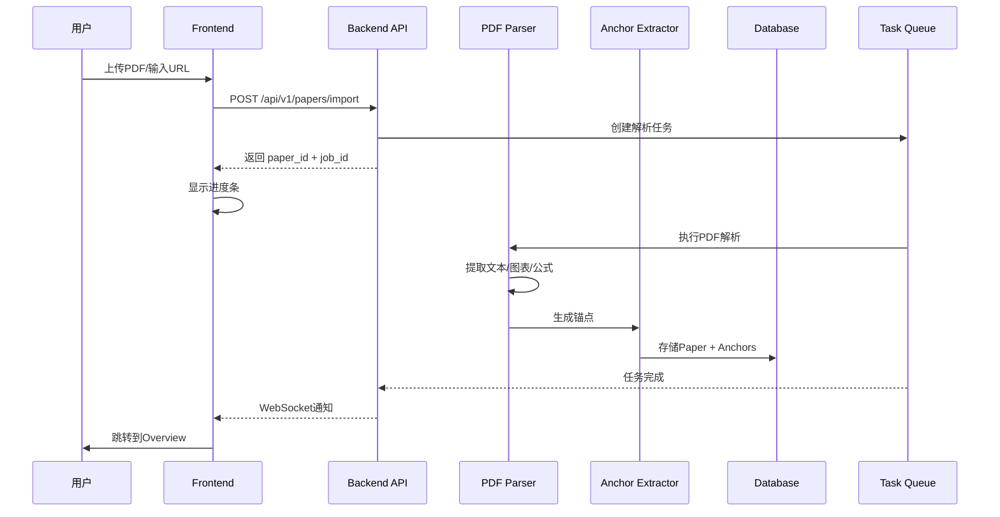
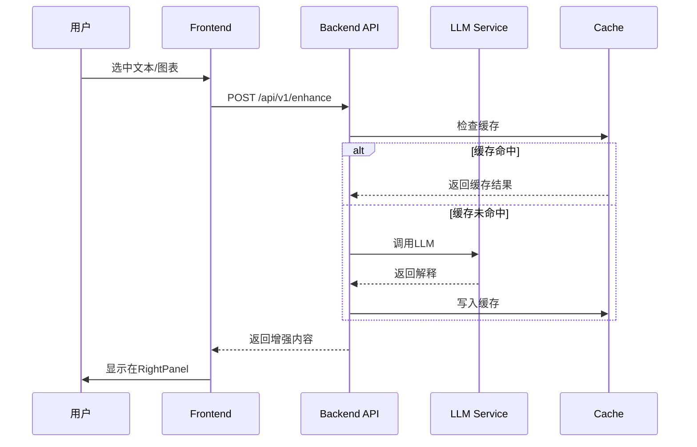

# 技术架构设计文档

## 1. 系统架构概览

```
┌─────────────────────────────────────────────────────────────────────────────┐
│                              客户端层 (Frontend)                             │
│  ┌─────────────────────────────────────────────────────────────────────┐    │
│  │                     Next.js 14 + React 18                           │    │
│  │  ┌──────────┐ ┌──────────┐ ┌──────────┐ ┌──────────┐ ┌──────────┐  │    │
│  │  │ Library  │ │ Overview │ │ DeepRead │ │ Reviewer │ │ Compare  │  │    │
│  │  └──────────┘ └──────────┘ └──────────┘ └──────────┘ └──────────┘  │    │
│  │  ┌──────────┐ ┌──────────┐ ┌──────────┐                            │    │
│  │  │  Notes   │ │   Chat   │ │  Import  │   + 全局组件库              │    │
│  │  └──────────┘ └──────────┘ └──────────┘                            │    │
│  └─────────────────────────────────────────────────────────────────────┘    │
│                                    │                                         │
│                          REST API + WebSocket                                │
└────────────────────────────────────┼────────────────────────────────────────┘
                                     │
┌────────────────────────────────────┼────────────────────────────────────────┐
│                              服务端层 (Backend)                              │
│  ┌─────────────────────────────────────────────────────────────────────┐    │
│  │                        FastAPI + Python 3.11                        │    │
│  │  ┌────────────┐ ┌────────────┐ ┌────────────┐ ┌────────────┐       │    │
│  │  │ Paper API  │ │ Anchor API │ │ Card API   │ │ Export API │       │    │
│  │  └────────────┘ └────────────┘ └────────────┘ └────────────┘       │    │
│  │  ┌────────────┐ ┌────────────┐ ┌────────────┐ ┌────────────┐       │    │
│  │  │ Skim API   │ │Enhance API │ │Compare API │ │ Review API │       │    │
│  │  └────────────┘ └────────────┘ └────────────┘ └────────────┘       │    │
│  └─────────────────────────────────────────────────────────────────────┘    │
│                                    │                                         │
│  ┌─────────────────────────────────────────────────────────────────────┐    │
│  │                          Core Services                              │    │
│  │  ┌────────────┐ ┌────────────┐ ┌────────────┐ ┌────────────┐       │    │
│  │  │PDF Parser  │ │LLM Service │ │Search Svc  │ │Anchor Svc  │       │    │
│  │  │ (MinerU)   │ │(DeepSeek)  │ │ (Tavily)   │ │            │       │    │
│  │  └────────────┘ └────────────┘ └────────────┘ └────────────┘       │    │
│  └─────────────────────────────────────────────────────────────────────┘    │
└────────────────────────────────────┼────────────────────────────────────────┘
                                     │
┌────────────────────────────────────┼────────────────────────────────────────┐
│                              数据层 (Storage)                                │
│  ┌──────────────┐  ┌──────────────┐  ┌──────────────┐  ┌──────────────┐     │
│  │  PostgreSQL  │  │    Redis     │  │ File Storage │  │ Vector DB    │     │
│  │  (主数据库)   │  │   (缓存)     │  │  (PDF/图片)   │  │ (Chroma)     │     │
│  └──────────────┘  └──────────────┘  └──────────────┘  └──────────────┘     │
└─────────────────────────────────────────────────────────────────────────────┘
```

## 2. 技术栈选择

### 2.1 前端技术栈

| 技术 | 版本 | 用途 |
|------|------|------|
| **Next.js** | 14.x | React框架，SSR/SSG支持 |
| **React** | 18.x | UI组件库 |
| **TypeScript** | 5.x | 类型安全 |
| **Tailwind CSS** | 3.x | 样式系统 |
| **Zustand** | 4.x | 状态管理 |
| **React Query** | 5.x | 服务端状态管理 |
| **PDF.js** | 3.x | PDF渲染 |
| **Monaco Editor** | - | 代码/公式编辑 |
| **Mermaid** | 10.x | 流程图渲染 |
| **react-pdf-highlighter** | - | PDF高亮批注 |

### 2.2 后端技术栈

| 技术 | 版本 | 用途 |
|------|------|------|
| **FastAPI** | 0.109+ | Web框架 |
| **Python** | 3.11+ | 主语言 |
| **Pydantic** | 2.x | 数据验证 |
| **SQLAlchemy** | 2.x | ORM |
| **Alembic** | 1.x | 数据库迁移 |
| **Celery** | 5.x | 异步任务队列 |
| **Redis** | 7.x | 缓存/消息队列 |

### 2.3 AI/ML服务

| 技术 | 用途 |
|------|------|
| **MinerU (magic-pdf)** | PDF解析，提取锚点 |
| **OpenAI兼容API** | LLM服务（DeepSeek/Qwen） |
| **Tavily** | 网络搜索 |
| **ChromaDB** | 向量数据库，语义检索 |

### 2.4 存储

| 技术 | 用途 |
|------|------|
| **PostgreSQL** | 主数据库（论文、卡片、用户） |
| **Redis** | 缓存、会话、任务队列 |
| **MinIO/S3** | 文件存储（PDF、图片） |
| **ChromaDB** | 向量存储（语义检索） |

## 3. 目录结构

```
FastPaperRead/
├── frontend/                      # Next.js 前端
│   ├── app/                       # App Router
│   │   ├── (main)/               # 主布局组
│   │   │   ├── library/          # 文献库页
│   │   │   ├── paper/[id]/       # 论文详情
│   │   │   │   ├── overview/     # 粗读页
│   │   │   │   ├── read/         # 精读页
│   │   │   │   ├── review/       # 审稿页
│   │   │   │   └── compare/      # 对比页
│   │   │   ├── notes/            # 笔记库
│   │   │   ├── chat/             # 对话
│   │   │   └── import/           # 导入
│   │   ├── api/                  # API Routes (BFF)
│   │   └── layout.tsx
│   ├── components/               # 组件库
│   │   ├── common/               # 通用组件
│   │   ├── reader/               # 阅读器组件
│   │   │   ├── PDFViewer/
│   │   │   ├── StructuredView/
│   │   │   ├── SelectionToolbar/
│   │   │   └── AnchorHighlight/
│   │   ├── enhance/              # 增强引擎UI
│   │   │   ├── EnhancePanel/
│   │   │   ├── TermExplainer/
│   │   │   ├── EquationExplainer/
│   │   │   └── FigureExplainer/
│   │   ├── cards/                # 卡片组件
│   │   │   ├── PaperCard/
│   │   │   ├── EvidenceCard/
│   │   │   └── CardEditor/
│   │   ├── checklist/            # 清单组件
│   │   └── compare/              # 对比组件
│   ├── hooks/                    # 自定义Hooks
│   ├── stores/                   # Zustand stores
│   ├── lib/                      # 工具函数
│   ├── types/                    # TypeScript类型
│   └── styles/                   # 全局样式
│
├── backend/                       # FastAPI 后端
│   ├── app/
│   │   ├── main.py               # FastAPI入口
│   │   ├── config.py             # 配置
│   │   ├── api/                  # API路由
│   │   │   ├── v1/
│   │   │   │   ├── papers.py     # 论文API
│   │   │   │   ├── anchors.py    # 锚点API
│   │   │   │   ├── cards.py      # 卡片API
│   │   │   │   ├── skim.py       # 粗读API
│   │   │   │   ├── enhance.py    # 增强API
│   │   │   │   ├── compare.py    # 对比API
│   │   │   │   ├── review.py     # 审稿API
│   │   │   │   └── export.py     # 导出API
│   │   │   └── deps.py           # 依赖注入
│   │   ├── core/                 # 核心服务
│   │   │   ├── parser/           # PDF解析
│   │   │   │   ├── pdf_parser.py
│   │   │   │   ├── anchor_extractor.py
│   │   │   │   └── figure_extractor.py
│   │   │   ├── llm/              # LLM服务
│   │   │   │   ├── client.py
│   │   │   │   ├── prompts.py
│   │   │   │   └── enhancer.py
│   │   │   ├── search/           # 搜索服务
│   │   │   └── vector/           # 向量服务
│   │   ├── models/               # 数据模型
│   │   │   ├── paper.py
│   │   │   ├── anchor.py
│   │   │   ├── card.py
│   │   │   ├── checklist.py
│   │   │   └── user.py
│   │   ├── schemas/              # Pydantic schemas
│   │   │   ├── paper.py
│   │   │   ├── anchor.py
│   │   │   ├── card.py
│   │   │   └── enhance.py
│   │   ├── crud/                 # CRUD操作
│   │   ├── tasks/                # Celery异步任务
│   │   │   ├── parse_paper.py
│   │   │   ├── generate_skim.py
│   │   │   └── enhance_content.py
│   │   └── utils/                # 工具函数
│   ├── migrations/               # Alembic迁移
│   ├── tests/                    # 测试
│   └── requirements.txt
│
├── docs/                          # 文档
├── docker/                        # Docker配置
│   ├── docker-compose.yml
│   ├── Dockerfile.frontend
│   └── Dockerfile.backend
└── scripts/                       # 脚本
```

## 4. 核心数据流

### 4.1 论文导入流程



### 4.2 增强引擎调用流程



## 5. 关键设计决策

### 5.1 锚点系统设计

锚点是整个系统的核心，所有内容都通过锚点关联到原文：

```python
# 锚点类型
AnchorType = Literal[
    "paragraph",   # 段落
    "figure",      # 图表
    "table",       # 表格
    "equation",    # 公式
    "citation",    # 引用
    "section",     # 章节
]

# 锚点结构
class Anchor:
    id: str              # 唯一ID
    paper_id: str        # 所属论文
    type: AnchorType     # 类型
    page: int            # 页码
    bbox: Tuple[float, float, float, float]  # 边界框 [x1, y1, x2, y2]
    text: str            # 文本内容
    section: str         # 所属章节
    caption: str | None  # 标题（图表用）
    metadata: dict       # 额外元数据
```

### 5.2 三层解释设计

增强引擎的三层解释：

```python
class ExplanationLevel(Enum):
    ONE_LINER = "one_liner"  # 一句话
    PLAIN = "plain"          # 通俗版
    STRICT = "strict"        # 严格版

class TermExplanation:
    term: str
    one_liner: str      # 10字以内
    plain: str          # 100字，类比/例子
    strict: str         # 学术定义+公式
    source_anchors: List[str]  # 来源锚点
    uncertainty: str    # "from_text" | "inferred" | "needs_verify"
```

### 5.3 卡片继承体系

```python
class BaseCard:
    id: str
    paper_id: str
    title: str
    content: str
    source_anchors: List[str]
    uncertainty: str
    status: str  # "draft" | "final"
    created_at: datetime
    updated_at: datetime

class PaperCard(BaseCard):
    """论文总结卡"""
    contributions: List[str]
    limitations: List[str]
    applicable_scope: str

class EvidenceCard(BaseCard):
    """证据卡"""
    claim: str
    evidence: str
    strength: str  # "strong" | "medium" | "weak"
    risks: List[str]

class MethodCard(BaseCard):
    """方法卡"""
    inputs: List[str]
    outputs: List[str]
    assumptions: List[str]
    pseudocode: str
```

### 5.4 状态管理策略

前端使用Zustand进行状态管理：

```typescript
// stores/paperStore.ts
interface PaperStore {
  // 当前论文
  currentPaper: Paper | null;
  anchors: Anchor[];
  
  // 阅读状态
  readingMode: 'overview' | 'deepread' | 'review' | 'compare';
  selectedAnchor: Anchor | null;
  readProgress: Map<string, boolean>;
  
  // 右侧面板
  rightPanelTab: 'enhance' | 'notes' | 'checklist' | 'chat' | 'timer';
  enhanceContent: EnhanceResult | null;
  
  // 操作
  selectAnchor: (anchor: Anchor) => void;
  markSectionDone: (sectionId: string) => void;
  setRightPanelTab: (tab: string) => void;
}
```

## 6. API设计原则

### 6.1 RESTful规范

- 使用标准HTTP方法：GET/POST/PUT/DELETE
- 资源命名使用复数名词：`/papers`, `/anchors`, `/cards`
- 使用嵌套路由表示关系：`/papers/{id}/anchors`
- 分页使用`limit`/`offset`或`cursor`

### 6.2 响应格式

```json
{
  "success": true,
  "data": { ... },
  "meta": {
    "total": 100,
    "page": 1,
    "limit": 20
  },
  "error": null
}
```

### 6.3 错误处理

```json
{
  "success": false,
  "data": null,
  "error": {
    "code": "PAPER_NOT_FOUND",
    "message": "论文不存在",
    "details": { "paper_id": "xxx" }
  }
}
```

## 7. 部署架构

### 7.1 开发环境

```yaml
# docker-compose.dev.yml
services:
  frontend:
    build: ./frontend
    ports: ["3000:3000"]
    volumes: ["./frontend:/app"]
    
  backend:
    build: ./backend
    ports: ["8000:8000"]
    volumes: ["./backend:/app"]
    depends_on: [db, redis]
    
  db:
    image: postgres:16
    ports: ["5432:5432"]
    
  redis:
    image: redis:7
    ports: ["6379:6379"]
    
  celery:
    build: ./backend
    command: celery -A app.tasks worker
    depends_on: [redis]
```

### 7.2 生产环境

```
┌─────────────────────────────────────────────────────────────┐
│                        Nginx / Caddy                        │
│                      (反向代理 + SSL)                        │
└─────────────────────────────┬───────────────────────────────┘
                              │
        ┌─────────────────────┼─────────────────────┐
        │                     │                     │
        ▼                     ▼                     ▼
┌───────────────┐    ┌───────────────┐    ┌───────────────┐
│   Frontend    │    │    Backend    │    │    Celery     │
│  (Next.js)    │    │  (FastAPI)    │    │   Workers     │
│   x 2 pods    │    │   x 3 pods    │    │   x 2 pods    │
└───────────────┘    └───────────────┘    └───────────────┘
                              │
        ┌─────────────────────┼─────────────────────┐
        │                     │                     │
        ▼                     ▼                     ▼
┌───────────────┐    ┌───────────────┐    ┌───────────────┐
│  PostgreSQL   │    │     Redis     │    │    MinIO      │
│   Primary     │    │   Cluster     │    │   Storage     │
└───────────────┘    └───────────────┘    └───────────────┘
```

## 8. 性能优化策略

### 8.1 前端优化

- 使用Next.js App Router的流式渲染
- PDF.js Web Worker分离主线程
- 虚拟滚动处理大量锚点
- 图片懒加载 + WebP格式
- React Query缓存API结果

### 8.2 后端优化

- Redis缓存增强结果（TTL 24h）
- 异步任务队列处理PDF解析
- 数据库索引优化（paper_id, anchor_type）
- 连接池管理
- LLM请求批处理

### 8.3 LLM优化

- 流式响应（SSE）
- Prompt缓存
- 分层调用（简单问题用小模型）
- 失败重试 + 降级策略


